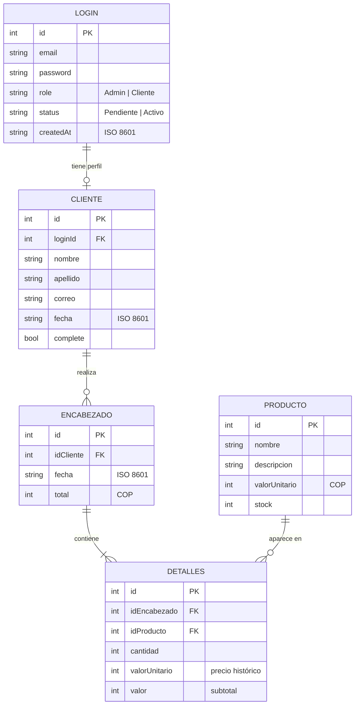

# Casa Nua

**Librería en línea con catálogo, carrito, control de inventario y administración de cuentas por roles, construida con HTML, CSS y JavaScript nativos.**

Casa Nua simula de punta a punta la operación de una librería independiente:

- **Cliente:** se registra, espera la aprobación de su cuenta, completa su perfil, elige libros, confirma su compra y consulta su historial.
- **Administrador:** aprueba cuentas, asigna roles, mantiene el catálogo y revisa todas las ventas.

Todo funciona en el navegador, sin backend ni dependencias. Los datos persisten en `localStorage`.

> **Proyecto académico.** Casa Nua es una demostración funcional de frontend. No reemplaza un backend ni un sistema de autenticación seguro. Ver [Limitaciones conocidas](#limitaciones-conocidas).

---

## Contenido

1. [Características](#características)
2. [Inicio rápido](#inicio-rápido)
3. [Cuentas de demostración](#cuentas-de-demostración)
4. [Roles y permisos](#roles-y-permisos)
5. [Flujos principales](#flujos-principales)
6. [Reglas de negocio](#reglas-de-negocio)
7. [Validaciones](#validaciones)
8. [Modelo de datos](#modelo-de-datos)
9. [Arquitectura](#arquitectura)
10. [Persistencia y sesión](#persistencia-y-sesión)
11. [Diseño, accesibilidad y diseño adaptable](#diseño-accesibilidad-y-diseño-adaptable)
12. [Reiniciar la demo](#reiniciar-la-demo)
13. [Limitaciones conocidas](#limitaciones-conocidas)
14. [Créditos](#créditos)

---

## Características

**Para el cliente**
- Registro con validación en vivo y aprobación posterior por un administrador.
- Perfil obligatorio antes de la primera compra.
- Catálogo con existencias visibles, selección de cantidad y carrito lateral.
- Carrito editable: cambiar cantidades, quitar un libro o vaciarlo, con el total recalculado al instante.
- Confirmación de compra con descuento de inventario e historial con detalle por pedido.

**Para el administrador**
- Panel con indicadores: clientes, solicitudes pendientes, tamaño del catálogo, ejemplares en inventario y ventas acumuladas.
- Aprobación de cuentas pendientes y asignación de rol (Cliente o Admin).
- Gestión del catálogo: crear, editar y eliminar libros, con confirmación antes de borrar.
- Listado de clientes con el estado de su perfil y de su cuenta.
- Consulta de todas las ventas y del detalle de cada pedido.

**Técnicas**
- Cero dependencias y sin paso de compilación: HTML5, CSS3 y módulos ES nativos.
- Control de acceso por rol en cada página.
- Precio histórico: cada línea de compra guarda el precio del día en que se confirmó.
- Escritura atómica de la compra: el encabezado, las líneas y el descuento de inventario se guardan juntos o no se guarda nada.
- Diseño adaptable (escritorio, tableta y móvil), foco visible con teclado, avisos accesibles y soporte para movimiento reducido.
- Sistema de diseño basado en variables CSS: colores, tamaños de letra y radios definidos una sola vez en `:root`.

---

## Inicio rápido

### Requisitos

- Un navegador moderno: Chrome, Edge, Firefox o Safari en versiones recientes.
- Un servidor web local. La aplicación usa módulos ES (`import` / `export`), que los navegadores bloquean si el archivo se abre directamente con `file://`.
- Conexión a internet para cargar las tipografías (Google Fonts) y las fotografías de fondo (Unsplash). Sin conexión, la aplicación funciona igual, pero con fuentes del sistema y fondo liso.

### Opción 1: Live Server (recomendada)

1. Abre la carpeta del proyecto en Visual Studio Code.
2. Instala la extensión **Live Server**.
3. Haz clic derecho sobre `index.html` y elige **Open with Live Server**.

### Opción 2: cualquier servidor estático

Desde la raíz del proyecto, ejecuta uno de estos comandos:

```bash
# Con Node.js
npx serve .

# Con Python 3
python -m http.server 5500
```

Luego abre la dirección que indique la consola (por ejemplo, `http://localhost:5500`).

### Clonar el repositorio

```bash
git clone https://github.com/SebastianGonzzalez/Casa_Nua.git
cd Casa_Nua
```

La primera vez que se abre la aplicación se cargan automáticamente dos cuentas de demostración y un catálogo de seis libros.

---

## Cuentas de demostración

| Rol | Correo | Contraseña |
|---|---|---|
| Administrador | `admin@tienda.local` | `Admin123!` |
| Cliente | `cliente@tienda.local` | `Cliente123!` |

La cuenta de cliente ya está activa y con el perfil completo, así que puede comprar de inmediato. Para probar el flujo completo de una cuenta nueva:

1. Regístrate desde la pantalla de inicio.
2. Entra como administrador y apruébala en **Solicitudes**.
3. Vuelve a entrar con la cuenta nueva.

---

## Roles y permisos

| Página | Archivo | Cliente | Administrador |
|---|---|:---:|:---:|
| Inicio de sesión y registro | `index.html`, `register.html` | Público | Público |
| Inicio (panel) | `dashboard.html` | ✓ | ✓ |
| Mi perfil | `profile.html` | ✓ | — |
| Comprar | `purchase.html` | ✓ (con perfil completo) | — |
| Historial de compras | `purchases.html` | Solo las propias | Todas |
| Detalle de compra | `details.html` | Solo las propias | Todas |
| Clientes | `clients.html` | — | ✓ |
| Solicitudes de acceso | `users.html` | — | ✓ |
| Productos | `products.html` | — | ✓ |

Cada página verifica la sesión al cargar ([js/auth.js](js/auth.js), `guardPage`):

- Sin sesión, redirige al inicio de sesión.
- Con una cuenta inactiva o con rol inválido, cierra la sesión.
- Si un cliente intenta abrir una página de administrador, lo envía a su panel.
- Si un cliente sin perfil completo intenta comprar, lo envía a su perfil.

---

## Flujos principales

### 1. Registro y aprobación

1. El visitante se registra con nombre, apellido, correo, contraseña y confirmación.
2. La cuenta queda con rol **Cliente** y estado **Pendiente**. Mientras esté pendiente no puede iniciar sesión, y el formulario le explica por qué.
3. Un administrador abre **Solicitudes**, elige el rol (Cliente o Admin) y la activa.

### 2. Inicio de sesión

- Con **Recordarme** marcado, la sesión sobrevive al cierre del navegador y el correo se precarga la próxima vez. Sin marcarlo, la sesión dura solo hasta cerrar la pestaña.
- El administrador entra a su panel. El cliente entra a su panel si su perfil está completo; si no, a **Mi perfil**.

### 3. Perfil

El cliente confirma nombre, apellido y correo. Al guardarlo, el perfil queda completo y se habilitan las compras. El correo no puede repetirse con otra cuenta.

### 4. Compra

1. En **Comprar**, cada libro muestra precio y ejemplares disponibles.
2. El cliente elige una cantidad y agrega el libro al carrito. Si pide más de lo disponible, la aplicación lo avisa y no lo agrega.
3. En el carrito puede ajustar cantidades, quitar libros o vaciarlo. El total se recalcula al instante.
4. Al confirmar, la aplicación valida todo de nuevo contra el inventario actual. Si es válido, guarda en una sola operación:
   - el **encabezado** del pedido (cliente, fecha y total),
   - una **línea de detalle** por libro, con su cantidad, precio unitario y subtotal,
   - el **descuento** de los ejemplares vendidos.
5. El cliente es redirigido al detalle del pedido recién creado.

### 5. Historial y detalle

- **Historial** lista los pedidos con número, cliente, fecha, cantidad de títulos y total.
- **Detalle** muestra los datos del pedido y una tabla con cada libro, su cantidad, el precio unitario del día de la compra y el subtotal.

### 6. Gestión del catálogo

El administrador crea y edita libros (nombre, descripción, precio y ejemplares) desde un formulario validado. Para eliminar uno, la aplicación pide confirmación. Los cambios se reflejan de inmediato en la pantalla de compra.

---

## Reglas de negocio

| Regla | Dónde se aplica |
|---|---|
| Una cuenta pendiente no puede iniciar sesión. | `initLogin` en [js/auth.js](js/auth.js) |
| Un cliente no accede a páginas de administración. | `guardPage` en [js/auth.js](js/auth.js) |
| Solo un cliente con perfil completo puede comprar. | `guardPage` y la confirmación de compra |
| El carrito nunca supera los ejemplares disponibles. | `validateCartQuantity` en [js/validators.js](js/validators.js) |
| La compra se confirma solo si todas sus líneas son válidas. | `validatePurchaseLines` en [js/validators.js](js/validators.js) |
| Las existencias se descuentan al confirmar, no al agregar al carrito. | [js/purchase.js](js/purchase.js) |
| Cada línea conserva el precio unitario histórico. | Campo `valorUnitario` en `detalles` |
| No puede haber dos libros con el mismo nombre (sin distinguir mayúsculas). | [js/products.js](js/products.js) |
| No puede haber dos cuentas con el mismo correo. | `emailAlreadyExists` en [js/validators.js](js/validators.js) |
| Un cliente solo ve sus propios pedidos. | [js/purchases.js](js/purchases.js) y [js/details.js](js/details.js) |

---

## Validaciones

Todos los límites viven en [js/config.js](js/config.js) y se pueden ajustar en un solo lugar.

| Dato | Regla |
|---|---|
| Nombre y apellido | 2 a 60 caracteres; solo letras (con tildes y ñ), espacios, guiones y apóstrofes. |
| Correo | Formato `nombre@dominio.ext`, máximo 120 caracteres; se normaliza a minúsculas y sin espacios. |
| Contraseña | 8 a 128 caracteres, con al menos una letra y un número; la confirmación debe coincidir. |
| Nombre de libro | Obligatorio; letras, números y puntuación básica (`' & ( ) . , -`). |
| Descripción | 5 a 500 caracteres. |
| Precio | Entero mayor que 0, hasta 999.999.999. |
| Ejemplares | Entero de 0 a 1.000.000. |
| Cantidad en el carrito | Entero positivo que no supere los ejemplares disponibles. |
| Rol | Solo `Admin` o `Cliente`; el inicio de sesión solo admite cuentas en estado `Activo`. |
| Totales | Subtotales y total deben ser enteros seguros (`Number.isSafeInteger`). |

Los errores de formulario aparecen junto a cada campo y el foco salta al primer campo con error. Los demás resultados (compra confirmada, libro agregado, falta de existencias) se anuncian con avisos accesibles (`aria-live`).

---

## Modelo de datos

La base de datos es un único objeto JSON con cinco colecciones.



- Los identificadores son enteros incrementales (`nextId`).
- Las fechas se guardan en ISO 8601.
- Los montos son pesos colombianos sin decimales y se muestran con `Intl.NumberFormat('es-CO')`.

---

## Arquitectura

```text
Casa_Nua/
├── index.html          Inicio de sesión (incluye el panel de registro)
├── register.html       Registro
├── dashboard.html      Panel según el rol
├── profile.html        Perfil del cliente
├── purchase.html       Catálogo y carrito
├── purchases.html      Historial de compras
├── details.html        Detalle de una compra
├── clients.html        Clientes (admin)
├── users.html          Solicitudes de acceso (admin)
├── products.html       Catálogo e inventario (admin)
├── css/
│   └── styles.css      Hoja de estilos única, basada en variables
├── js/
│   ├── app.js          Punto de entrada: carga inicial, guardas y arranque de cada página
│   ├── config.js       Claves de almacenamiento, roles, estados y límites
│   ├── storage.js      Lectura y escritura de la base, sesión y datos semilla
│   ├── auth.js         Login, registro, guardas de página y activación de cuentas
│   ├── validators.js   Reglas de negocio y validación de datos
│   ├── utils.js        Formato de moneda y fecha, escape de HTML, avisos y ayudas de formulario
│   ├── shell.js        Barra superior y navegación según el rol
│   ├── icons.js        Íconos SVG en línea
│   ├── dashboard.js    Indicadores y accesos rápidos
│   ├── profile.js      Formulario de perfil
│   ├── purchase.js     Catálogo, carrito y confirmación de compra
│   ├── purchases.js    Historial
│   ├── details.js      Detalle de compra
│   ├── clients.js      Listado de clientes
│   ├── users.js        Aprobación de cuentas
│   └── products.js     Alta, edición y baja de productos
└── README.md
```

**Cómo arranca cada página.** Todas cargan el mismo `js/app.js`, que:

1. siembra los datos de demostración si hace falta,
2. aplica la guarda de acceso de la página,
3. dibuja la barra de navegación según el rol,
4. invoca todos los inicializadores (`initLogin`, `initPurchase`, etc.). Cada uno busca su elemento raíz en el DOM y no hace nada si no lo encuentra, así que una sola entrada sirve para todas las páginas.

**Seguridad de la interfaz.** Todo dato del usuario que se inserta en el HTML pasa por `esc()` ([js/utils.js](js/utils.js)), que escapa `& < > " '` para evitar inyección de HTML.

---

## Persistencia y sesión

| Clave | Almacén | Contenido |
|---|---|---|
| `parcialCompraDB_v2` | `localStorage` | Base de datos completa (las cinco colecciones). |
| `parcialCompraSession_v2` | `localStorage` o `sessionStorage` | Sesión activa (`loginId`, rol y correo). Va a `localStorage` con **Recordarme** y a `sessionStorage` sin él. |
| `rememberedLogin_v2` | `localStorage` | Correo precargado en el inicio de sesión. |

- Si existe una base de una versión anterior (`parcialCompraDB_v1`), se migra automáticamente y se reconstruye el precio unitario de las líneas antiguas.
- Si los datos guardados están corruptos, la aplicación arranca con una base vacía en lugar de fallar.

---

## Diseño, accesibilidad y diseño adaptable

La identidad visual se inspira en "la biblioteca de noche":

- Paneles de vidrio ahumado sobre fotografías de biblioteca.
- Dorado como acento.
- Playfair Display para títulos, Lato para la interfaz y Cormorant Garamond para cifras.

Todos los colores, tamaños de letra y radios salen de variables CSS en `:root` ([css/styles.css](css/styles.css)).

**Accesibilidad**
- HTML semántico con `lang="es"`, regiones (`header`, `nav`, `main`) y enlace para saltar al contenido.
- Foco visible con teclado: contorno dorado en botones y enlaces, y borde dorado en campos.
- Objetivos táctiles de al menos 44 × 44 px.
- Etiquetas en todos los campos y errores asociados a cada uno.
- Avisos anunciados por lectores de pantalla (`aria-live`) y estado del menú móvil con `aria-expanded`.
- Texto con contraste suficiente sobre los fondos oscuros.
- Con `prefers-reduced-motion`, se desactivan las animaciones de entrada y los desplazamientos al pasar el cursor.

**Diseño adaptable**

| Ancho | Comportamiento |
|---|---|
| Más de 1050 px | Catálogo en 3 columnas; navegación con íconos y etiquetas. |
| 841 a 1050 px | Catálogo en 2 columnas; navegación solo con etiquetas. |
| 651 a 840 px | Menú desplegable; indicadores y paneles a 1 columna; carrito debajo del catálogo (que sigue en 2 columnas); fotos de fondo más livianas. |
| 650 px o menos | Catálogo y formularios en 1 columna; márgenes reducidos. |

---

## Reiniciar la demo

Para volver al estado inicial:

1. Abre las herramientas de desarrollo del navegador (F12) y ve a **Application** (Chrome/Edge) o **Almacenamiento** (Firefox).
2. En **Local Storage** y **Session Storage** del sitio, elimina las claves `parcialCompraDB_v2`, `parcialCompraSession_v2` y `rememberedLogin_v2`.
3. Recarga la página. Las cuentas y el catálogo de demostración se vuelven a crear.

También puedes pegar esto en la consola del navegador:

```js
['parcialCompraDB_v2', 'parcialCompraSession_v2', 'rememberedLogin_v2'].forEach(key => {
  localStorage.removeItem(key);
  sessionStorage.removeItem(key);
});
location.reload();
```

---

## Limitaciones conocidas

Son decisiones propias de una demo sin backend. En un sistema en producción habría que resolverlas:

- **Seguridad:**
  - Las contraseñas se guardan en texto plano en `localStorage`.
  - Toda la lógica corre en el navegador, así que cualquier usuario con las herramientas de desarrollo puede leer o modificar los datos.
  - La autenticación y los permisos sirven para demostrar el flujo, no para proteger información real.
- **Datos locales:** la información vive solo en el navegador donde se creó. No se comparte entre equipos ni navegadores, y se pierde al borrar los datos del sitio.
- **Pagos simulados:** confirmar una compra no procesa ningún pago.
- **Recuperar contraseña:** no está implementado.
- **Catálogo de ejemplo:** si el catálogo queda vacío, o no contiene ningún libro reconocible, la aplicación vuelve a cargar los seis libros de demostración en la siguiente carga de página.
- **Libros eliminados:** al borrar un libro, los pedidos anteriores conservan su cantidad, precio y subtotal, pero el nombre aparece como "Producto eliminado", porque no se guarda una copia del nombre en cada línea.
- **Recursos externos:** las tipografías y las fotografías de fondo se cargan desde Google Fonts y Unsplash, así que requieren conexión.

---

## Créditos

- **Desarrollo:** [SebastianGonzzalez](https://github.com/SebastianGonzzalez)
- **Tipografías:** [Playfair Display](https://fonts.google.com/specimen/Playfair+Display), [Lato](https://fonts.google.com/specimen/Lato) y [Cormorant Garamond](https://fonts.google.com/specimen/Cormorant+Garamond), vía Google Fonts.
- **Fotografías de fondo:** [Unsplash](https://unsplash.com).
- **Íconos:** SVG propios en línea ([js/icons.js](js/icons.js)).
